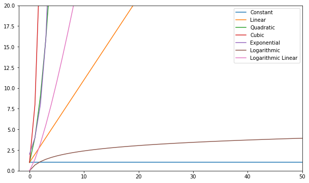

# Big-O notation 

---

signifies the relationship between the input to the algorithm and the steps required to execute the algorithm. It is denoted by a big "O" followed by an opening and closing parenthesis. Inside the parenthesis, the relationship between the input and the steps taken by the algorithm is presented using "n".


---
## Algorithm Analysis with Big-O Notation


| Name        | 	Big O   |
| ----------- | ----------- |
| Constant    | 	O(c)    |
| Linear      |     O(n)    |
|Quadratic	  |     O(n²)   |
|Cubic	      |     O(n³)   |
|Exponential  |     O(2ⁿ)   |
|Logarithmic  |	 O(log(n))  |
|Log Linear	  |O(nlog(n))   |


### You can visualize these functions and compare them:




---
---

# Names and Variables in Python :


A variable can have a short name (like x and y) or a more descriptive name (age, carname, total_volume).

## Rules for Python variables:

* A variable name must start with a letter or the underscore character
* A variable name cannot start with a number
* A variable name can only contain alpha-numeric characters and underscores (A-z, 0-9, and _ )
* Variable names are case-sensitive (age, Age and AGE are three different variables)


## Global Variables

Variables that are created outside of a function (as in all of the examples above) are known as global variables.

Global variables can be used by everyone, both inside of functions and outside.

* Example
```
{
x = 5
y = "John"
print(x)
print(y)
}
```