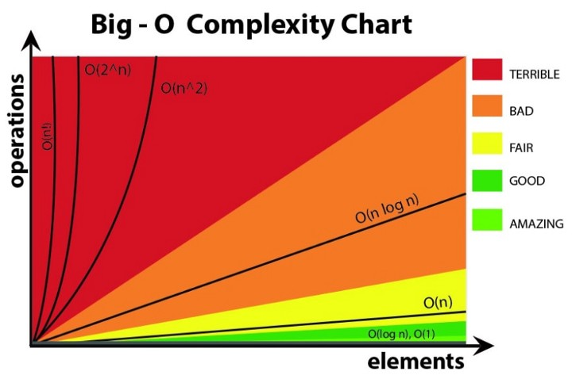

# A Beginner’s Guide to Big O Notation :

When we write code, it’s important to understand how our choice of code impacts the speed and performance of the program we’re creating. Big O Notation is a way to classify how quickly the runtime of the algorithm/number of operations or space increases in relation to the input n. It looks at the worst case scenario, assuming every possible element is touched on as the algorithm is written.

There are seven classifications in Big O Notation, ranging from fantastic, fast and/or space efficient solutions that remain constant despite the input size, to absolutely terrible, please-don’t-ever-use-these solutions!

---

## Here are some common types of time complexities in Big O Notation :

* O(1) - Constant time complexity
* O(n) - Linear time complexity
* O(log n) - Logarithmic time complexity
* O(n^2) - Quadratic time complexity

### O(1) — Constant Time
Constant time algorithms will always take same amount of time to be executed. The execution time of these algorithm is independent of the size of the input. A good example of O(1) time is accessing a value with an array index.

### O(n) - Linear time complexity
An algorithm has a linear time complexity if the time to execute the algorithm is directly proportional to the input size n. Therefore the time it will take to run the algorithm will increase proportionately as the size of input n increases

### O(log n) - Logarithmic time complexity
An algorithm has logarithmic time complexity if the time it takes to run the algorithm is proportional to the logarithm of the input size n. An example is binary search, which is often used to search data sets.

### O(n^2) - Quadratic time complexity
An algorithm has quadratic time complexity if the time to execution it is proportional to the square of the input size. A good example of this is checking to see whether there are any duplicates in a deck of cards.

You will encounter quadratic time complexity in algorithms involving nested iterations, such as nested for loops. In fact, the deeper nested loops will result in O(n^3), O(n^4), etc.