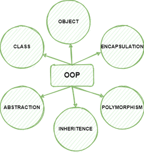

# object-oriented Programming (OOPs) 
---
is a programming paradigm that uses objects and classes in programming. It aims to implement real-world entities like inheritance, polymorphisms, encapsulation, etc. in the programming. The main concept of OOPs is to bind the data and the functions that work on that together as a single unit so that no other part of the code can access this data.

---
## Main Concepts of Object-Oriented Programming (OOPs) 
* Class
* Objects
* Polymorphism
* Encapsulation
* Inheritance
* Data Abstraction

---
## CLASSES
Class 
A class is a collection of objects. A class contains the blueprints or the prototype from which the objects are being created. It is a logical entity that contains some attributes and methods. 

To understand the need for creating a class let’s consider an example, let’s say you wanted to track the number of dogs that may have different attributes like breed, age. If a list is used, the first element could be the dog’s breed while the second element could represent its age. Let’s suppose there are 100 different dogs, then how would you know which element is supposed to be which? What if you wanted to add other properties to these dogs? This lacks organization and it’s the exact need for classes.  