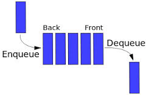

# Stacks and Queues

Stack is a container of objects that are inserted and removed according to the last-in first-out (LIFO) principle.

Queue is a container of objects (a linear collection) that are inserted and removed according to the first-in first-out (FIFO) principle.

## Stack:

In the pushdown stacks only two operations are allowed: push the item into the stack, and pop the item out of the stack. A stack is a limited access data structure - elements can be added and removed from the stack only at the top. push adds an item to the top of the stack, pop removes the item from the top. A helpful analogy is to think of a stack of books; you can remove only the top book, also you can add a new book on the top.

### Applications, Advantages and Disadvantages of Stack

Stack is a simple linear data structure used for storing data. Stack follows the LIFO(Last In First Out) strategy that states that the element that is inserted last will come out first. You can take a pile of plates kept on top of each other as a real-life example. The plate which we put last is on the top and since we remove the plate that is at the top, we can say that the plate that was put last comes out first.  It can be implemented through an array or linked lists. Some of its main operations are: push(), pop(), top(), isEmpty(), size(), etc.  In order to make manipulations in a stack, there are certain operations provided to us. When we want to insert an element into the stack the operation is known as the push operation whereas when we want to remove an element from the stack the operation is known as the pop operation. If we try to pop from an empty stack then it is known as underflow and if we try to push an element in a stack that is already full, then it is known as overflow.

Primary Stack Operations:

void push(int data): When this operation is performed, an element is inserted into the stack.
int pop():   When this operation is performed, an element is removed from the top of the stack and is returned.
Auxiliary Stack Operations:

int top(): This operation will return the last inserted element that is at the top without removing it.
int size(): This operation will return the size of the stack i.e. the total number of elements present in the stack.
int isEmpty(): This operation indicates whether the stack is empty or not.
int isFull(): This operation indicates whether the stack is full or not.

---

## Queue:

An excellent example of a queue is a line of students in the food court of the UC. New additions to a line made to the back of the queue, while removal (or serving) happens in the front. In the queue only two operations are allowed enqueue and dequeue. Enqueue means to insert an item into the back of the queue, dequeue means removing the front item. The picture demonstrates the FIFO access. The difference between stacks and queues is in removing. In a stack we remove the item the most recently added; in a queue, we remove the item the least recently added.

### Applications of Queue Data Structure

Queue is used when things don’t have to be processed immediately, but have to be processed in First In First Out order. 

Useful Applications of Queue
When a resource is shared among multiple consumers. Examples include CPU scheduling, Disk Scheduling. 
When data is transferred asynchronously (data not necessarily received at the same rate as sent) between two processes. Examples include IO Buffers, pipes, etc. 
Applications of Queue in Operating systems:
Semaphores
FCFS ( first come first serve) scheduling, example: FIFO queue
Spooling in printers
Buffer for devices like keyboard
 
 
 ### Applications of Queue in Networks:

Queues in routers/ switches 
Mail Queues
Variations: ( Deque, Priority Queue, Doubly Ended Priority Queue )

### Some other applications of Queue:

Applied as waiting lists for a single shared resource like CPU, Disk, and Printer.
Applied as buffers on MP3 players and portable CD players.
Applied on Operating system to handle the interruption.
Applied to add song at the end or to play from the front.
Applied on WhatsApp when we send messages to our friends and they don’t have an internet connection then these messages are queued on the server of WhatsApp.

